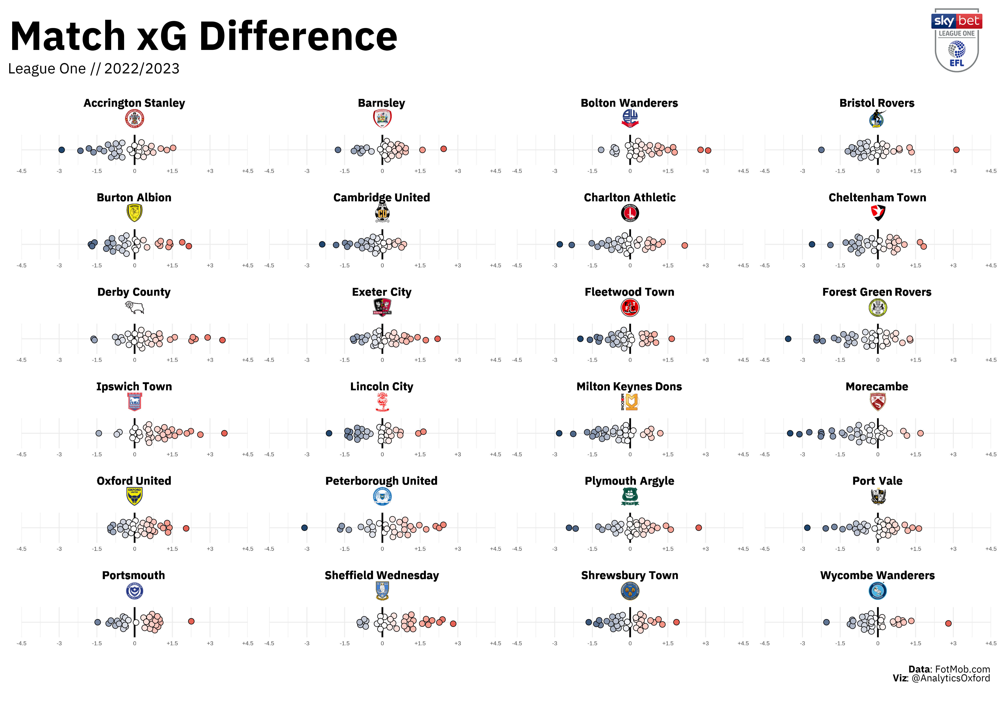
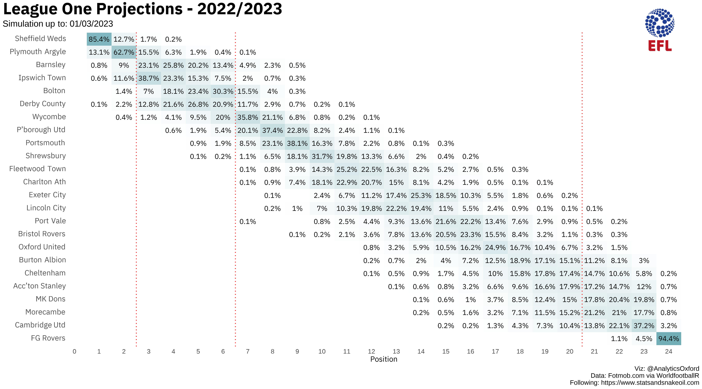
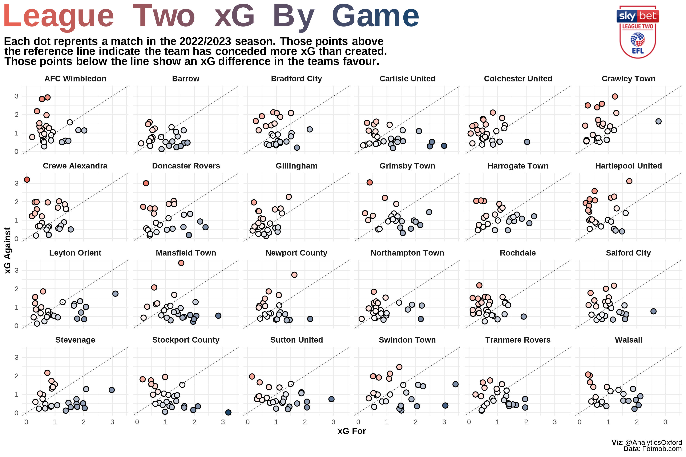
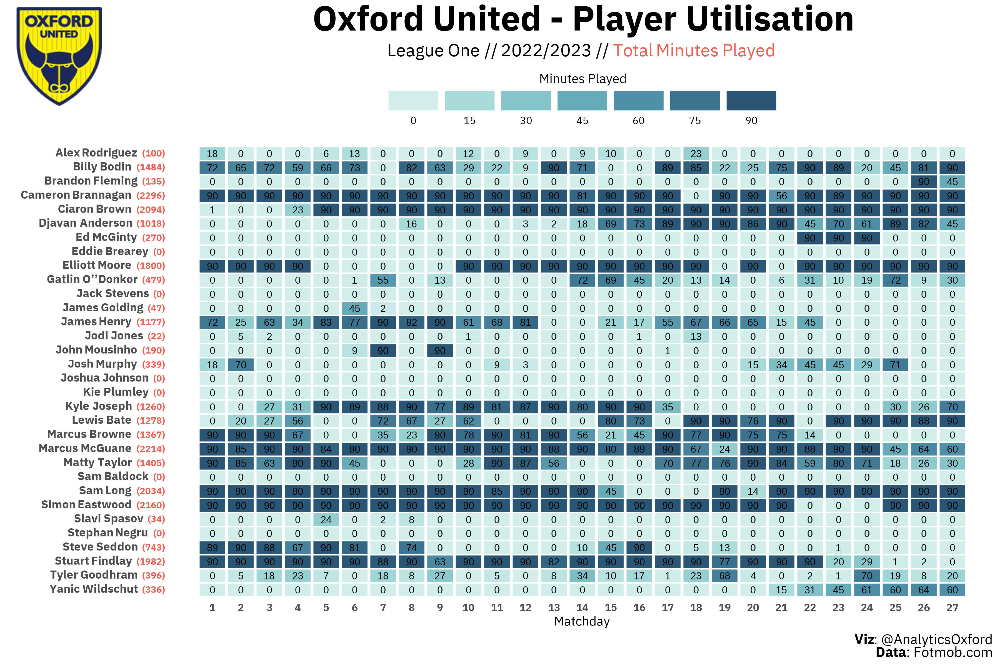
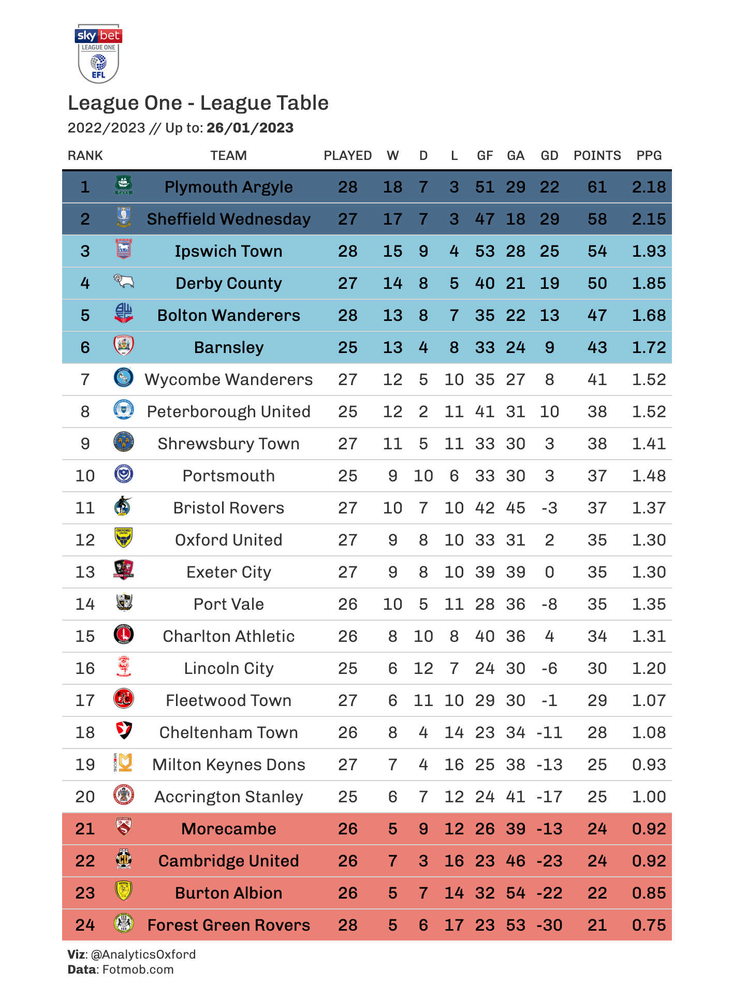
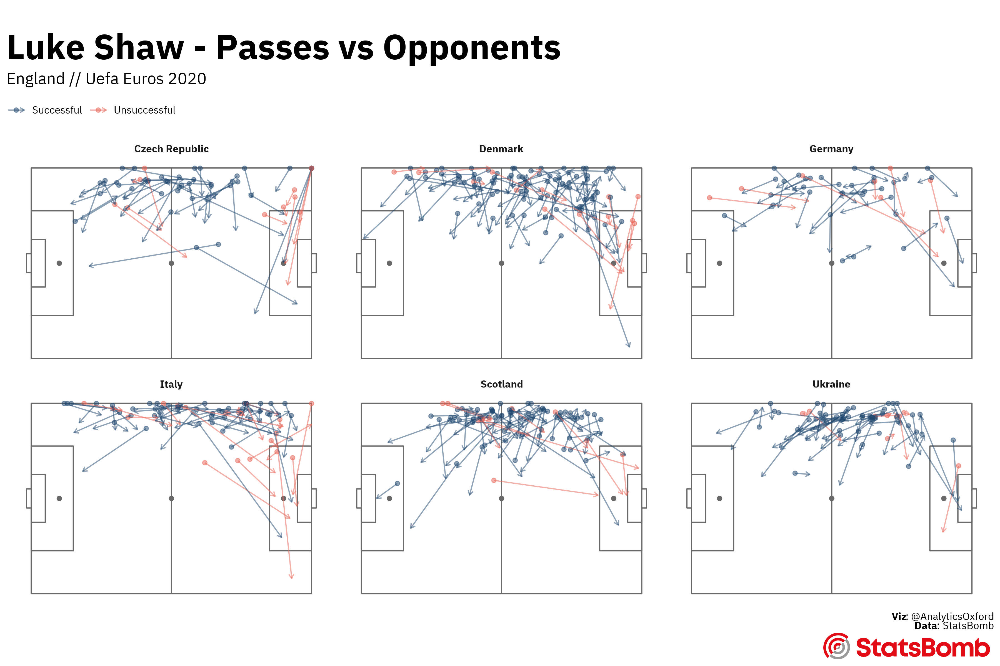
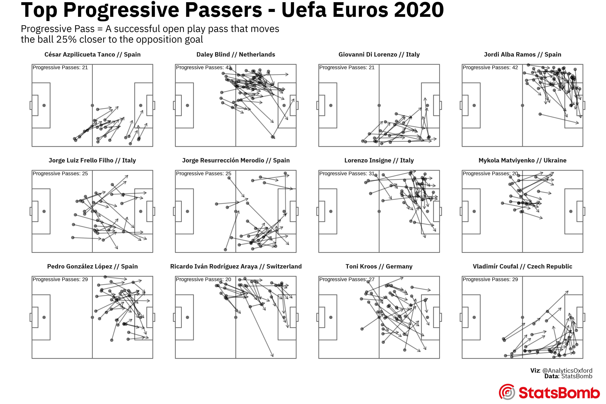

## Introduction

A repo of visuals used in football analytics.

Data used includes:

-   [StatsBomb](https://github.com/statsbomb/open-data) Free Event Data

-   [Understat](https://understat.com/) via [worldfootballR](https://github.com/JaseZiv/worldfootballR)

-   [FotMob](https://www.fotmob.com/) via worldfootballR

-   [Transfermarkt](https://www.transfermarkt.com/) via worldfootballR

Functions used within some of the below code exist via [globals.R](https://github.com/Markjwilkins/analytics_toolbox/blob/main/globals.R) whilst Uefa event data is in [data](https://github.com/Markjwilkins/analytics_toolbox/tree/main/data).

## xG Difference Beeswarm

[Repo](https://github.com/Markjwilkins/analytics_toolbox/tree/main/R/xg_difference_beeswarm)

## League Simulation

[Repo](https://github.com/Markjwilkins/analytics_toolbox/tree/main/R/league_simulation)

## Match xG Difference

[Repo](https://github.com/Markjwilkins/analytics_toolbox/tree/main/R/match_xg)

Includes both a static plot below, along with an interactive plot in a markdown file. The interactivity acheived through ggiraph.

## Squad Usage

[Repo](https://github.com/Markjwilkins/analytics_toolbox/tree/main/R/squad_usage)

## League Table

[Repo](https://github.com/Markjwilkins/analytics_toolbox/tree/main/R/league_table)

## Pass Plot

[Repo](https://github.com/Markjwilkins/analytics_toolbox/tree/main/R/pass_plot)

## Progressive Passes

[Repo](https://github.com/Markjwilkins/analytics_toolbox/tree/main/R/progressive_passes)

